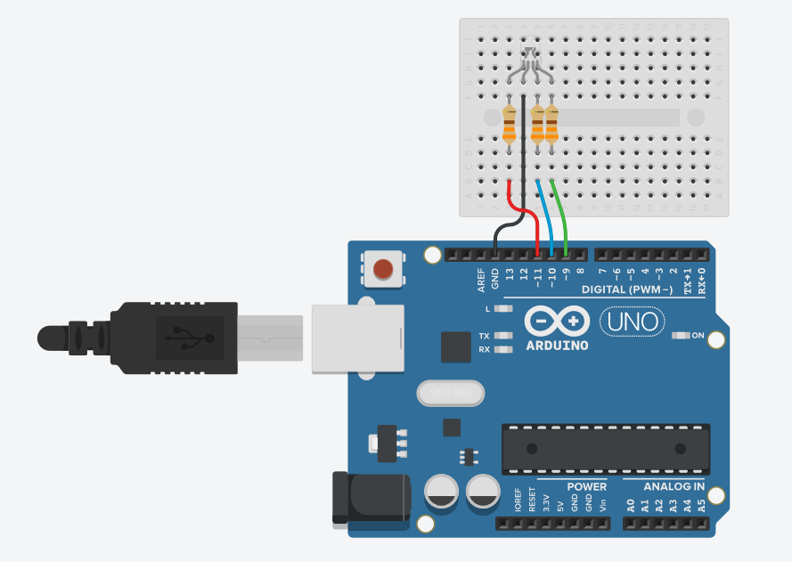
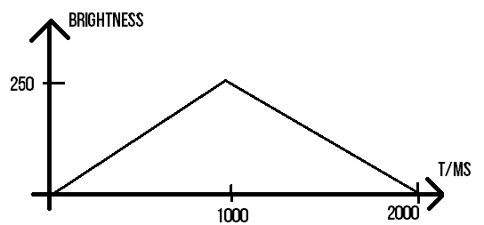
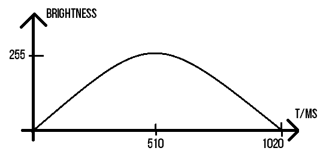
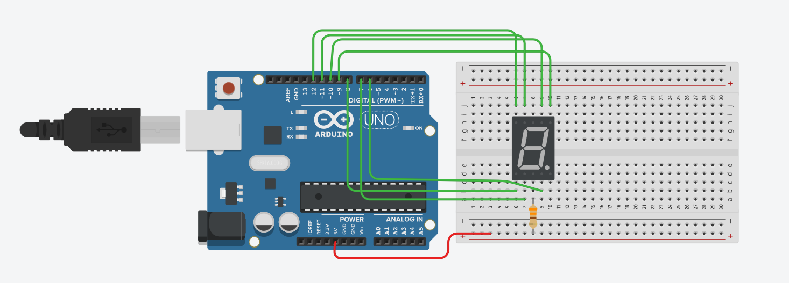
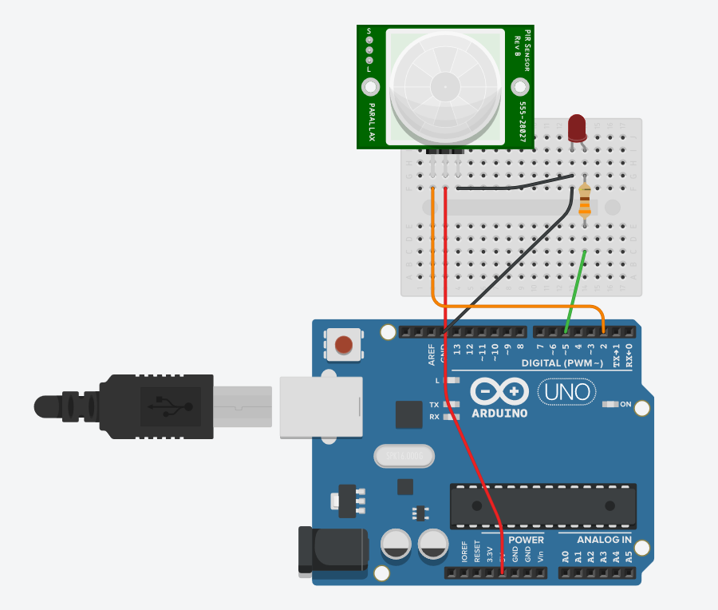
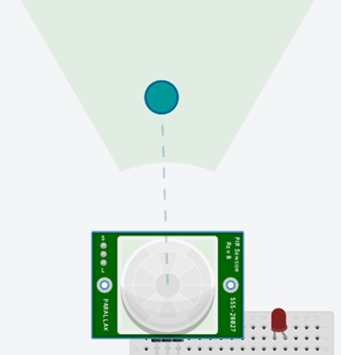

# Arduino Practice
#### Week 7 Session

* Just a quick way to practice prototyping and the concepts with the Arduino, and to learn a few new components and sensors!
* For this practice, please use **Tinkercad** **Circuit** to try them out. (If you have the actual components, it would be recommended to use the actual hardware instead of the simulated one.)
* Should take **approximately 1 - 2h** to complete all the activities, have fun coding!

> If stuck or unsure on how to tackle the activity, the `search engine` is your good friend.

## 1. Waving RGB Lighting

Fascinated with the LED strips on speakers or shopping more? Here’s your chance to create something similar! Let’s try out fading the RGB LED with some sine wave! Wire the schematics as shown.

### Task A

Turn `On` the LEDs one at a time for `2000ms`, and then off in the following order: `Red, Blue, Green`. (It would start from Red again after green.)

### Task B

Fade the LEDs in a half triangular waveform for `1000ms` and then off using a `while loop`. It would follow this order: `Blue, Red, Green`. (It would start from Blue again after Green.)

* Use a `while loop` to change the brightness. (Hint: You need 2!)
* The maximum brightness would be set at `250`.
* Each LED would ramp up in brightness for 1s, and then ramp down for 1s. (Total of 2s)

### Task C

Fade the LEDs in a half cycle sinusoidal waveform for `800ms` and then off in the following order: `Red, Green, Blue`. (It would start from Red again after Blue.)

* Use a `for loop` to change the brightness. (Hint: You need 1!)
* The maximum brightness would be set at `255`.
* Each LED would ramp up in brightness for 0.51s, and then ramp down for 0.51s. (Total of 1.02s)

## 2. 7 Segment Display (Common Anode)

Remember the traffic light digits counting down when we are crossing the road? We would be trying out this **common anode** 7 segment display, which activates the LED when the pin is grounded! Wire the schematics as shown.

### Task A

Turn **On** the segments one at a time for `500ms` to test out which pin corresponds to which segments. 

* Note down which pins corresponds to which Arduino pin.

![[1]](assets/c_an_7seg.jpg)

### Task B

Display the number ‘0’ once. (Hint: Determine which segments need to be ON, which are OFF)

### Task C

Display the numbers 0 – 9 **once**. 

* You can use a 2D array to store the segments to be ON/OFF to display the different numbers.
* `for loop` could be used to iterate this 2D array.

![[2]](assets/act2b_7seg.gif)

### Task D

Reverse the order and countdown the number from 9 to 0, after which it would repeat itself. Each number would be displayed for 1 s, just like an actual timer!

### Task E

Code for A – F (a hexadecimal extension), and countdown from F to 0.

* Hint: Just add the hexadecimal characters to the 2D array.

![[3]](assets/act2e_hex.png)

## 3. Motion Activated Light (MAL)

In order to save power, some lights in the public area are equipped with a PIR sensor to brighten the area when motion is detected, else it would be dim. For this activity, we would be doing something similar: Turn on the LED for 3 seconds! Wire the schematics as shown.

### Task A

Read the values of the PIR Sensor every 0.1s via `digitalRead()`. Use the Serial monitor to display the PIR sensor value, and determine how long the PIR sensor remains active.

**Triggering the sensor**

The motion sensor can be triggered by shifting the blue circle when the simulation is running.

### Task B

Trigger the LED (using the **polling method**) to turn on for 3 seconds when motion is detected.

* Recall what is **polling**.
* Write a function to trigger the LED for 3 seconds when motion is detected.

![[4]](assets/act3b.jpg)

### Task C

Trigger the LED (using the `interrupt method`) to turn on for 3 seconds when motion is detected.

* Recall what is **interrupt**, and how is it implemented.
* Write a function (that would be called via the `Interrupt Service Routine, ISR`) to update the state of the LED when motion is detected using `attachInterrupt()`.
* `delay()` and `millis()` does not work in the ISR, but `micros()` could be used. [5]
* Hint: The for loop would be used for keeping track the time, the ISR would be used to set the state of the LED and record the current time with `micros()`.

## References

[1] https://www.sunfounder.com/media/wysiwyg/swatches/super-kit-v2-for-Arduino/10_7_seg_display/anode.jpg

[2] http://gadgetronicx.com/wp-content/uploads/2014/07/7seg1.gif

[3] https://lastminuteengineers.com/wp-content/uploads/2018/06/7-Segment-Display-Number-Formation-Segment-Contol.png

[4] https://luytsm.github.io/mcu-cursus/slides/img/polling_vs_interrupts.jpg

[5] https://arduino.stackexchange.com/questions/22212/using-millis-and-micros-inside-an-interrupt-routine

## Changelog

**V1.0 (22/10/20)**

* Initial release

**V1.1 (25/10/20)**

* Added more details for the questions
* Split the sections up
* Updated images, added graphs

**V1.2 (29/10/20)**

- Fix some typos
- Fix inconsistencies between questions and answers
- Standardize code formatting
